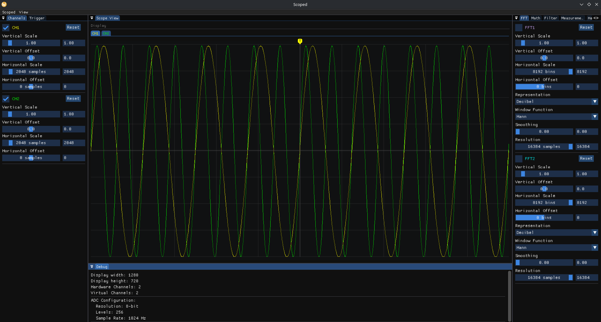

# Scoped

Scoped is a computer-based digital oscilloscope software built in C++ specifically designed for Linux desktops.



## Current Progress & Features

- **Signal Rendering:** Real-time intensity-graded time-domain trace rendering.
- **Trigger Engine:** Customizable edge triggering with UI markers and interactive controls.
- **Hardware Abstraction:** Simulated sine wave generators for testing, with scaffolding ready for physical FPGA/USB endpoints.
- **FFT Processing:** Real-time frequency domain analysis powered by `pocketfft`, featuring adjustable windows and resolutions.
- **Math Operations:** Virtual channels that perform addition, subtraction, multiplication, inversion, integration, and FFT-based differentiation across traces.
- **Digital Filters:** Dual-biquad cascade architecture supporting Lowpass, Highpass, Bandpass, and Bandstop Butterworth filters. Includes real-time interactive Log-scale Bode plot visualization of the frequency response.
- **Measurements:** Native computation of Vpp, Vrms, Vavg, Vmin, Vmax, Frequency, and Period. Sources can be intelligently targeted at either raw hardware channels or the outputs of prior Math/Filter processors.
- **Modular UI:** Cleanly separated UI modules with a dockable workspace (Channels, FFT, Math, Filters, Trigger, Measurements, and Hardware tabs).

## Building from Source

Scoped requires CMake (>= 3.15) and a modern C++20 compiler.

### Dependencies
- SDL2 (`libsdl2-dev`)
- OpenGL (`libgl1-mesa-dev`)
- libusb-1.0 (`libusb-1.0-0-dev`)
- pkg-config

### Compilation

```bash
mkdir build
cd build
cmake ..
make -j$(nproc)
./Scoped
```

## Next Steps

The software side is mostly complete and fully functional with simulated inputs. The current focus is on building the FPGA-based hardware frontend.

Future software features are described in docs/TODO.md.

## Hardware Features

- ADC: TBD
- FPGA: Muse LAB iCESugar-Pro v1.3 