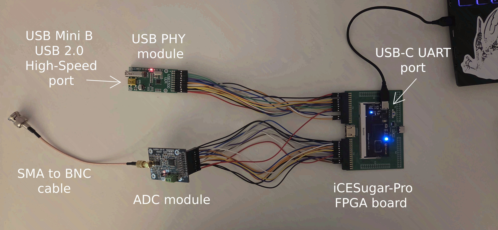

# Scoped

Scoped is a C++ software oscilloscope with an FPGA frontend.


## Features

Scoped is designed with a modern, modular user interface featuring fully dockable tabs.

- **Display:**
  - Hardware-accelerated digital phosphor rendering.
  - Controls for vertical/horizontal scale and offset for each trace.

- **Trigger:**
  - Rising and falling edge triggering.
  - Source and level selection.

- **FFT:**
  - Real-time Fast Fourier Transform powered by `pocketfft`.
  - **Window functions:** Rectangular, Hanning, Hamming, Blackman-Harris, Flat Top.
  - Linear or Decibel (dB) scale.

- **Math:**
  - Addition, Subtraction, Multiplication, Inversion, Integration, Differentiation.

- **Filters:**
  - Cascaded dual-biquad filter architecture.
  - **Responses:** Lowpass, Highpass, Bandpass, Bandstop.
  - **Topologies:** Butterworth, Bessel, Chebyshev.
  - Frequency response graph.

- **Measurements:**
  - Vpp, Vrms, Vavg, Vmin, Vmax, Frequency, and Period.

- **Acquisition:**
  - High-speed ACD to FPGA hardware backend.
  - Connection to scope software frontend over USB or UART.

## Building from Source

CMake (>= 3.15) and C++20 compiler.

### Dependencies

- SDL2 (`libsdl2-dev`)
- OpenGL (`libgl1-mesa-dev`)
- libusb-1.0 (`libusb-1.0-0-dev`)
- pkg-config

### Compilation

```bash
make setup
make all
make run
```

## Hardware Specs

The following setup was used for testing. The USB PHY and ADC modules are connected to the iCESugar-Pro FPGA board using 20 cm DuPont jumper wires. Shorter wires would've been preferred as I was having signal integrity issues and was constantly dropping the USB 2.0 HS connection.

<br>
<div align="left">
  
</div>
<br>

### ADC

AD9226 module
- 65M samplers per second (max)
- 12-bit resolution

<br>
<div align="left">
  
</div>
<br>


### FPGA

Muse LAB iCESugar-Pro v1.3
- Lattice ECP5

<br>
<div align="left">
  
</div>
<br>

### USB PHY

USB3300 USB High-Speed PHY Board
- USB 2.0 High-Speed (480 Mbps)
- ULPI Interface

<br>
<div align="left">
  
</div>
<br>

## Mext Steps

A custom PCB needs to be made for the hardware backend to fix the signal integrity issues with the USB PHY. This will allow for full-speed operation with a much faster ADC acquisition rate as samples can be sent to the software much faster over USB 2.0 HS compared to UART.

Future software features are described in docs/TODO.md.