# Scoped

Scoped is a C++ software oscilloscope with a field-programmable gate array (FPGA) frontend.

<br>
<div align="left">
  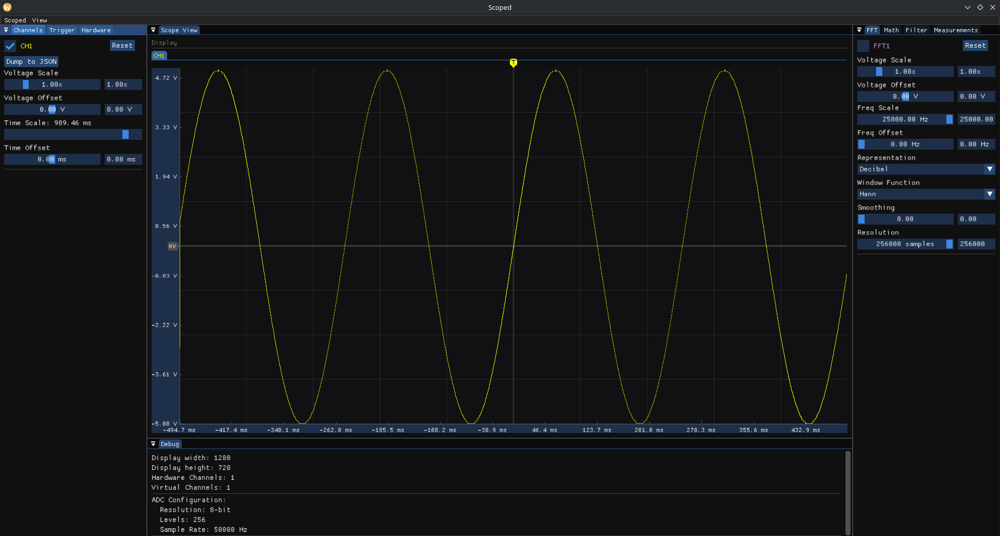
</div>
<br>

## Setup

The image below shows the setup used for the [Demo](#demo) and [Features](#features) sections. A more detailed explanation of the hardware backend can be found in the [Hardware Specs](#hardware-specs) section.

The UART connection was used instead of USB 2.0 because the USB connection repeatedly dropped due to signal integrity issues. This was caused by the large ground loop introduced when connecting the signal generator through the long jumper wires and individual test boards. To verify this, I temporarily connected the FPGA ground to the signal generator ground and observed packet loss only while the connection was active.

<br>
<div align="left">
  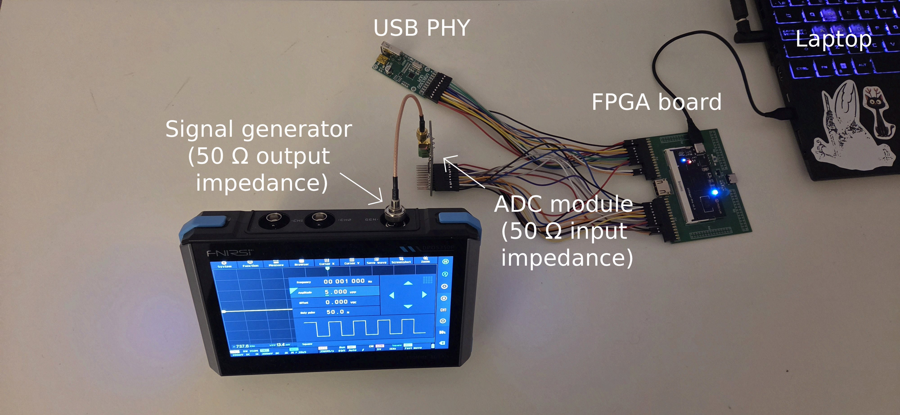
</div>
<br>

**Note:** Both the signal generator and ADC input have 50 Ω impedance, resulting in the measured voltage being ≈half the expected value.

## Demo

Scoped accurately displays signals of varying types, frequencies, amplitudes, and DC offsets using an input from my signal generator

<table>
  <tr>
    <td>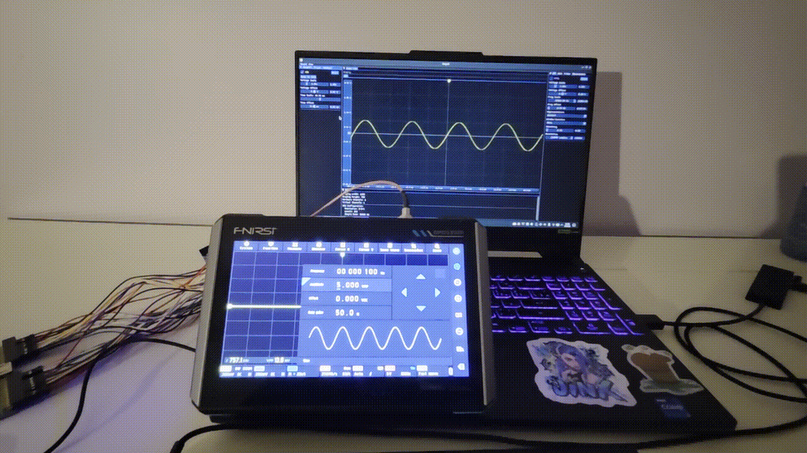</td>
    <td>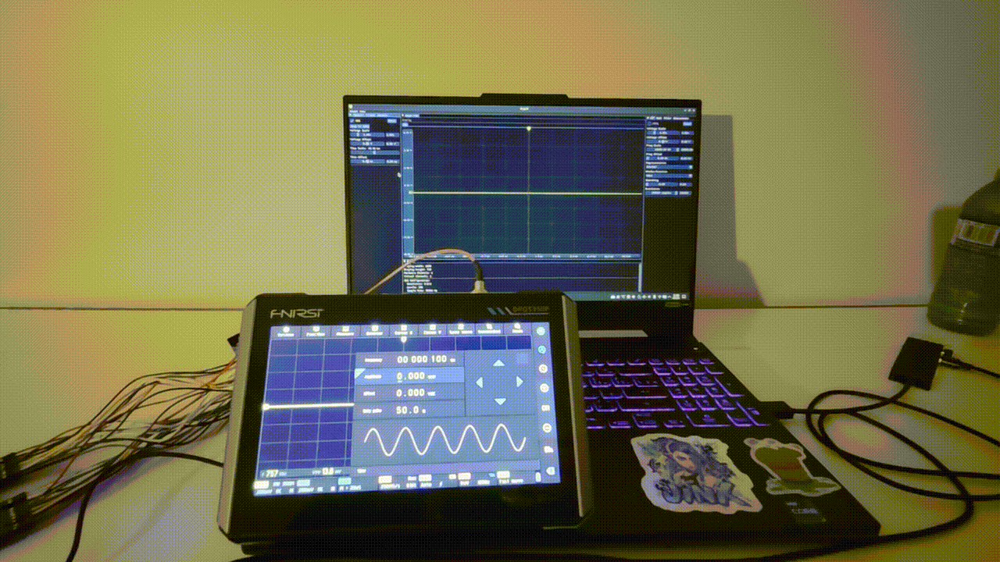</td>
  </tr>
  <tr>
    <td>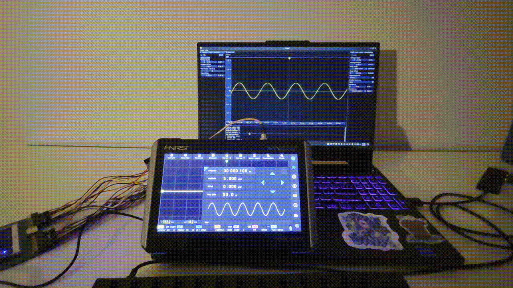</td>
    <td>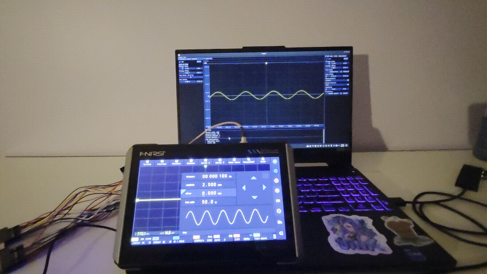</td>
  </tr>
</table>


## Features

Scoped is designed with a modern, modular user interface featuring fully dockable tabs.

### Display:
  - Hardware-accelerated digital phosphor rendering.
  - Channel controls for vertical/horizontal scale and offset.

<br>
<div align="left">
  
</div>
<br>

### Trigger:
  - Rising and falling edge triggering.
  - Source and level selection.
  - Auto (50 ms) and normal (wait for edge) trigger modes.

<br>
<div align="left">
  
</div>
<br>

### FFT:
  - Real-time Fast Fourier Transform powered by `pocketfft`.
  - **Window functions:** Rectangular, Hanning, Hamming, Blackman-Harris, Flat Top.
  - Linear or Decibel (dB) scale.

<br>
<div align="left">
  
</div>
<br>

### Math:
  - Addition, Subtraction, Multiplication, Inversion, Integration, Differentiation.

<br>
<div align="left">
  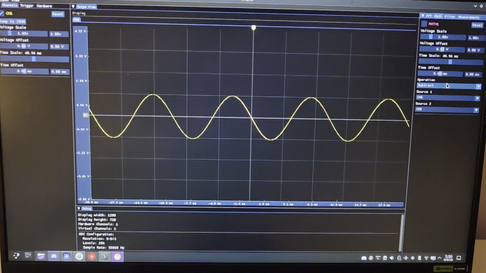
</div>
<br>

### Filters:
  - Cascaded dual-biquad filter architecture.
  - **Responses:** Lowpass, Highpass, Bandpass, Bandstop.
  - **Topologies:** Butterworth, Bessel, Chebyshev.
  - Frequency response graph.

<br>
<div align="left">
  
</div>
<br>

### Measurements:
  - Vpp, Vrms, Vavg, Vmin, Vmax, Frequency, and Period.

<br>
<div align="left">
  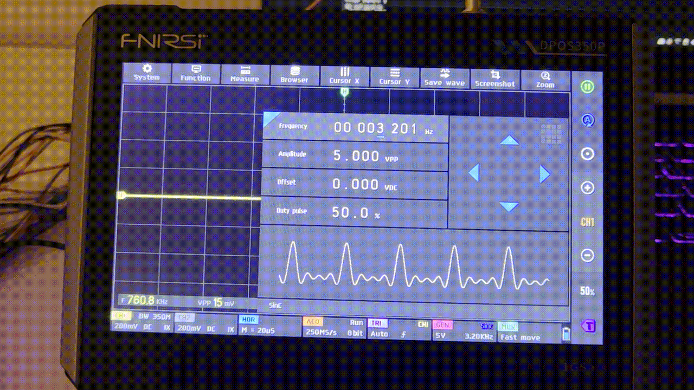
</div>
<br>

### Hardware:
  - High-speed ACD to FPGA hardware backend.
  - Connection to scope software frontend over USB or UART.

<br>
<div align="left">
  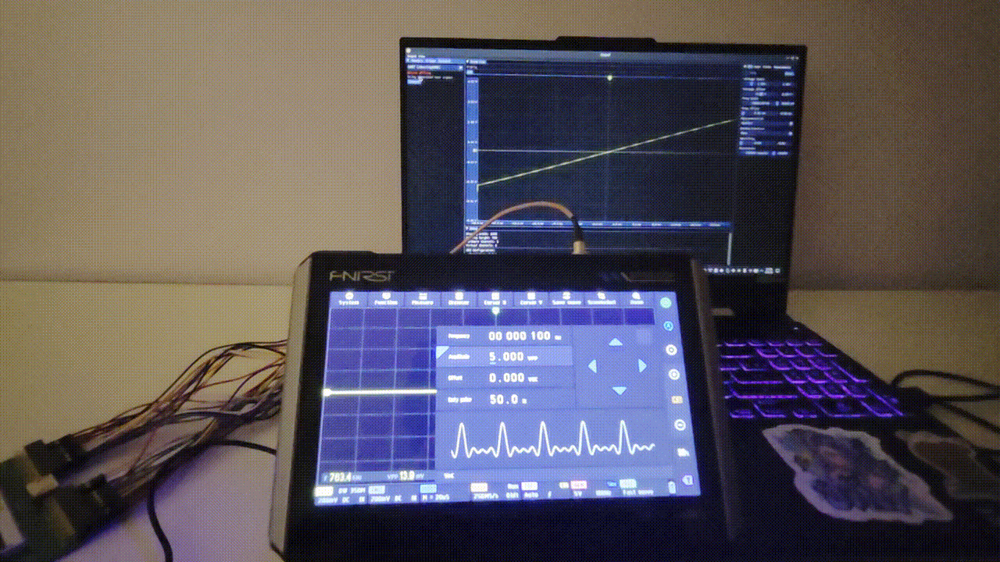
</div>
<br>

## Architecture

Scoped uses a modular, two-pass data pipeline separated into core processing layers:

<br>
<div align="left">
  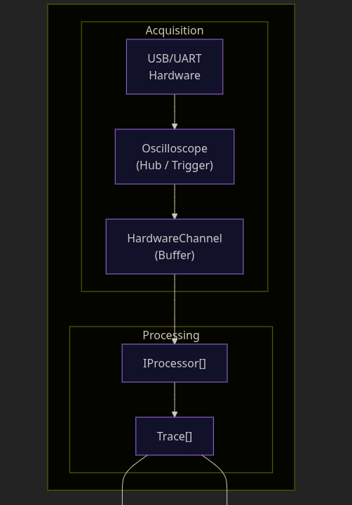
  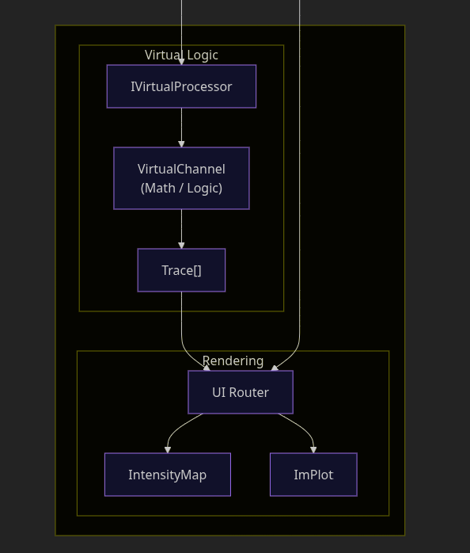
</div>
<br>

- **Oscilloscope:** Manages hardware interfaces (USB/UART), coordinates global triggers, and drives the multi-channel synchronization engine.
- **Channels:** `HardwareChannel` handles lock-free buffer acquisition, while `VirtualChannel` processes cross-channel logic. Both yield standard `Trace` objects.
- **Processors:** Expandable modules (FFT, Filters, Math, Measurements) that take raw frames and mutate or generate new trace representations.
- **UI:** Iterates over generated traces and maps them to the appropriate rendering subsystems (digital phosphor map or standard plots) based on their domain metadata.

For an in-depth breakdown of the data pipeline and the codebase file map, please see the full [Architecture Documentation](docs/ARCHITECTURE.md).

## Hardware Specs

Scoped's hardware consists of an FPGA board, ADC module, and USB PHY. The USB PHY and ADC modules were connected to the iCESugar-Pro FPGA board using 20 cm DuPont jumper wires.

Either the UART or USB 2.0 port can be used to connect to the software: 
- **UART:** Runs at 1 MBaud, supporting an ADC acquisition rate of 50 kHz; it is slower but more stable.
- **USB 2.0:** Runs at up to 480 Mbps, supporting an ADC acquisition rate of 25 MHz in the current implemenation; it provides much faster data transfer and acquisition rates, but the high-speed signals are more prone to signal integrity issues.

HDL implementations are provided for both configurations and must be synthesized separately.

<br>
<div align="left">
  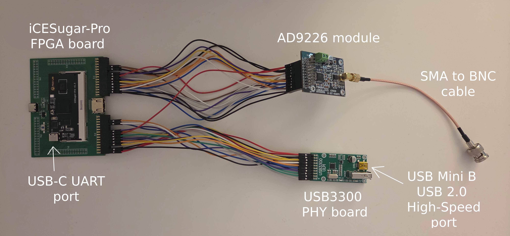
</div>
<br>

### ADC

AD9226 module
- 65M samples per second (max)
- 12-bit resolution

<br>
<div align="left">
  
</div>
<br>


### FPGA

Muse LAB iCESugar-Pro v1.3
- Lattice ECP5

<br>
<div align="left">
  
</div>
<br>

### USB PHY

USB3300 USB High-Speed PHY Board
- USB 2.0 High-Speed (480 Mbps)
- ULPI Interface

<br>
<div align="left">
  
</div>
<br>

## Building from Source

### Software Frontend

CMake (>= 3.15) and C++20 compiler.

#### Dependencies

- SDL2 (`libsdl2-dev`)
- OpenGL (`libgl1-mesa-dev`)
- libusb-1.0 (`libusb-1.0-0-dev`)
- pkg-config

#### Compilation

```bash
make setup
make all
make run
```

### Hardware (HDL)

To build the FPGA bitstream, you will need the following tools installed:
- [Yosys](https://github.com/YosysHQ/yosys) (Synthesis)
- [nextpnr-ecp5](https://github.com/YosysHQ/nextpnr) (Place and Route)
- [Project Trellis / ecppack](https://github.com/YosysHQ/prjtrellis) (Bitstream generation)

#### Compilation & Programming

Navigate to the `hdl/` directory to build the bitstream and program the FPGA:

```bash
cd hdl/
make all      # Generates the bitstream (.bit)
make prog     # Programs the FPGA over USB
```

### Simulation

To run the HDL simulations and verify the RTL, [Verilator](https://www.veripool.org/verilator/) is required.

#### Running Tests

Navigate to the `sim/` directory and run the simulation:

```bash
cd sim/
make sim
```

## Next Steps

A custom PCB needs to be designed for the hardware backend to fix the signal integrity issues with the USB PHY. This will allow for full-speed operation with a much faster ADC acquisition rate.

Future software features are described in docs/TODO.md.
