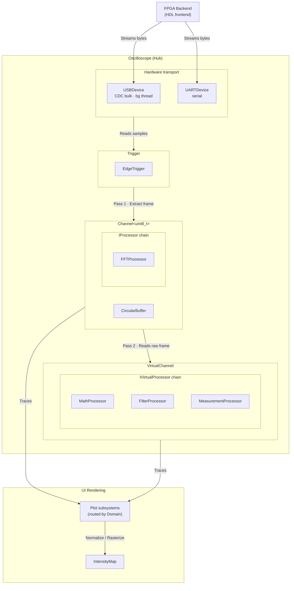
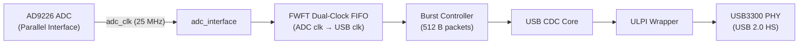

# Scoped Architecture

Scoped is a C++ software oscilloscope backed by an FPGA frontend. It is split into two parts: the software frontend and the HDL backend, separated by a USB/UART transport. This document expands on the overview in the [README](../README.md) `Architecture` section, covering each layer, the core objects, and the codebase file maps.

## Software Architecture

The software is built around a modular, two-pass data pipeline.
At a high level, data flows through five stages: the hardware captures samples, the hub drives synchronized frames, channels own the acquisition and processing, processors generate traces, and the UI renders them.

### Objects

This section describes each object in more detail, and the ordering follows the path data takes through the system.

#### Hardware Interface

Provides data acquisition from the FPGA backend.

- **USBDevice**: CDC bulk-transfer interface running a background thread for high-speed streaming.
- **UARTDevice**: Slower serial interface for stable data capture at lower sampling rates.

#### Oscilloscope

The central core abstraction. Owns the hardware connections (`USBDevice` / `UARTDevice`), the global trigger engine (`ITrigger`), and an array of abstract `IChannel` objects. Provides multi-channel synchronization by evaluating a trigger on a source channel and capturing a time-aligned frame across all channels simultaneously.

#### ITrigger

Abstract base for type-agnostic trigger strategies. Operates on normalized float samples from an `IChannel` to avoid coupling with a specific bit-depth.

- Exposes `getUIParameters()` and `getTriggerLevels()` so the UI can dynamically generate controls (sliders, combos) and draw trigger lines.
- **EdgeTrigger**: Fires when a sample crosses a threshold with hysteresis. Supports rising/falling edge selection.

#### CircularBuffer\<T\>

Lock-free ring buffer for raw sample acquisition.

#### IChannel, Channel\<HardwareT\> & VirtualChannel

There are two kinds of channel, and the difference is *where their data comes from*:

- **IChannel**: The common interface every channel implements. Exposes normalized samples and output traces.
- **Channel\<HardwareT\>** = a **hardware channel**: The pipeline for real signals. It owns a `CircularBuffer` filled by the physical input (USB/UART) and a chain of `IProcessor`s that turn that raw frame into traces.
- **VirtualChannel** = a **virtual channel**: It has no buffer and no input of its own. Instead, it reads finished frames from source `IChannel`s (typically hardware channels) and applies `IVirtualProcessor`s to compute new, derived traces (e.g., math, filtering, measurements).

Because virtual channels read from other channels, they must be processed *after* their sources using a Two-Pass system.
1. **Pass 1 — hardware channels.** Loop over every hardware channel and, for each one, extract the frame aligned to the trigger, run its processors, and produce its traces.
2. **Pass 2 — virtual channels.** Only after *all* hardware channels are done, loop over every virtual channel and compute their derived traces. By this point the hardware channels they read from hold the current frame, so the results are correct.

#### IProcessor & IVirtualProcessor

Both processor base classes derive from `IProcessorControl`, which exposes the uniform UI controls (enable state, scale/offset, color) shared by all processing modules.

- **IProcessor** applies isolated signal processing on a single channel's raw frame. Its only implementation is `FFTProcessor`.
- **IVirtualProcessor** takes data from multiple channel traces and produces new traces. Implementations include `MathProcessor` (cross-channel math), `FilterProcessor`, and `MeasurementProcessor`.

#### Trace

A single output artifact representing a plottable line or matrix. Contains metadata such as `Domain::Time` or `Domain::Frequency` along with localized scaling parameters. Extensible for Decoders and Measurements.

#### IntensityMap

2D hit-count grid for digital phosphor display. Accepts time-domain normalized data and rasterizes using Bresenham lines. Rasterization is performed on the CPU into a host-side hit-count grid, which is then converted to RGBA and uploaded to an OpenGL texture (`updateTexture` → `glTexSubImage2D`) and drawn by the GPU. The texture reserves `width × height × RGBA` bytes of VRAM; for the default 1280×720 display this is 1280 × 720 × 4 ≈ 3.5 MiB.

### File Map

The software codebase is organized into four main modules within the `core` directory:

#### `common/`

Core data structures and base interfaces.

| File | Role |
|---|---|
| `oscilloscope.hpp` | Central hub & Two-Pass updater |
| `channel.hpp` | IChannel, Channel\<T\>, VirtualChannel |
| `trace.hpp` | Trace object + Domain metadata |
| `circularbuffer.hpp` | Ring buffer (header-only template) |
| `constants.hpp` | Global configuration constants |

#### `hardware/`

Physical communication layers.

| File | Role |
|---|---|
| `usb.hpp/.cpp` | High-speed USB CDC acquisition |
| `uart.hpp/.cpp` | Serial UART acquisition |

#### `processing/`

Signal processing nodes.

| File | Role |
|---|---|
| `iprocessor.hpp` | Base classes IProcessorControl, IProcessor, IVirtualProcessor |
| `trigger.hpp` | ITrigger + EdgeTrigger |
| `filter_processor.hpp` | Cascaded dual-biquad IIR filter |
| `fft_processor.hpp` | Real-time Fast Fourier Transform |
| `math_processor.hpp` | Cross-channel math operations |
| `measurement_processor.hpp` | Waveform statistics (Vpp, Vrms, Freq) |
| `window.hpp` | Window functions for FFT |

#### `ui/`

User Interface and rendering.

| File | Role |
|---|---|
| `ui.hpp/.cpp` | Main UI layout, rendering loops |
| `ui_*.cpp` | Submodules for Channels, FFT, Math, Filters |
| `intensitymap.hpp/.cpp` | Phosphor display rasterizer |
| `ui_helpers.hpp` | ImGui helper utilities |
| `colors.hpp` | Centralized color themes |

#### Root

| File | Role |
|---|---|
| `main.cpp` | SDL lifecycle + main loop initialization |

## Hardware (HDL) Architecture

The HDL backend captures samples from the ADC, synchronizes them across clock domains, and streams them to the host over USB (or UART). At a high level, data flows through four stages: the ADC interface samples the parallel bus, a dual-clock FIFO bridges the ADC and USB clock domains, a burst controller reads out packets, and the USB CDC core transmits them over ULPI to the PHY.

### Clock Domains

There are two independent clock domains that must be bridged:

- **ADC clock (`clk_25m`, 25 MHz):** The FPGA generates `adc_clk_out` and feeds it back to the ADC. The ADC drives its parallel 12-bit data bus synchronously to this clock, and `adc_interface` registers the samples on it.
- **ULPI clock (`ulpi_clk60`, 60 MHz):** Provided by the USB3300 PHY for all USB transport logic.

Because these clocks are independent and unrelated, samples cannot be passed between them directly; a dual-clock FIFO is required.

### adc_interface

Registered on the 25 MHz ADC clock, this module captures the parallel sample bus and presents it as a single-cycle `sample_valid`/`sample_data` stream to the write side of the FIFO. It also generates the 25 MHz clock fed back to the ADC and flags over-range via `adc_otr`. A 2-FF reset synchronizer (`adc_rst_sync`) deasserts reset into the ADC clock domain.

### fwft_dual_clk_fifo

A First-Word Fall-Through (FWFT) dual-clock FIFO wrapping a standard `dual_clk_fifo`. On the write side it accepts samples at the ADC clock; on the read side it presents the oldest sample immediately on its output (fall-through behavior), so `rd_data` is valid as soon as `empty` is low — no separate read enable handshake is needed before the first word. It also exposes a `count` of buffered samples used by the burst controller.

### Burst Controller (adc_wrapper)

The `adc_wrapper` instantiates both the `adc_interface` and the FWFT FIFO, and adds a small state machine that reads the FIFO on the ULPI clock and streams samples out. Its behavior is configured by a `CTYPE` parameter:

- **USB mode:** Waits in `IDLE` until the FIFO holds at least 511 samples, then enters `BURST` and transmits a fixed 511-sample packet (≈512 B with framing) on every `tx_ready && tx_valid` handshake, returning to `IDLE` once the burst completes. This batches samples into large efficient USB transfers.
- **UART mode:** Uses a burst size of 1, transmitting each sample as it arrives.

The 12-bit ADC sample is truncated to its 8 MSBs (`tx_data_12b[11:4]`) at the top level before transmission, giving the software an effective 8-bit resolution.

### usb_cdc_core & ulpi_wrapper

The `usb_cdc_core` implements a USB Communication Device Class (CDC) endpoint, packetizing the incoming sample stream into USB bulk transfers. It drives the `ulpi_wrapper`, which translates the core's UTMI signals to and from the ULPI interface: it multiplexes the 8-bit ULPI data bus in both directions and generates the `stp`/`nxt`/`dir` handshaking to the PHY. The PHY handles the physical USB 2.0 High-Speed signaling.

### Reset

A `rst_gen` module generates a power-on reset. For USB, an additional CDC reset is synchronized into the 60 MHz ULPI domain before use. LEDs provide visual status.

### UART Variant

The `top_uart` module replaces the USB transmit path with a 1 MBaud UART transmitter. A decimator captures 1 in every 500 ADC samples to derive a 50 kHz acquisition rate from the 25 MHz ADC clock, and a generated 1 MHz UART clock drives a `uart_tx_8n1` transmitter that serializes each 8-bit sample.

### HDL File Map

The HDL is organized under the `hdl/` directory.

#### `adc/`

| File | Role |
|---|---|
| `adc_interface.sv` | Captures the parallel ADC bus on the 25 MHz clock |
| `adc_wrapper.sv` | ADC interface + FWFT FIFO + burst controller state machine |

#### `common/`

| File | Role |
|---|---|
| `fwft_dual_clk_fifo.sv` | First-word fall-through wrapper over `dual_clk_fifo` |
| `dual_clk_fifo.sv` | Standard dual-clock FIFO (write/read clock domains) |
| `dual_port_dual_clk_ram.sv` | Dual-port, dual-clock RAM backing the FIFO |
| `rst_gen.v` | Power-on reset generator |
| `ODDRX1F.v` | ODDR primitive for output clock generation |
| `sine_gen.v` | Test sine generator |

#### `usb/`

| File | Role |
|---|---|
| `usb_cdc_core.v` | USB CDC core (device side) |
| `ulpi_wrapper.v` | UTMI ↔ ULPI interface translation |
| `usb_desc_rom.v` | USB descriptor ROM (CDC descriptors) |
| `usbf_crc16.v` | USB CRC16 generator |
| `usbf_device_core.v` | USB device core |
| `usbf_sie_rx.v` | USB serial interface engine (receive) |
| `usbf_sie_tx.v` | USB serial interface engine (transmit) |
| `usbf_defs.v` | USB protocol definitions |

#### `uart/`

| File | Role |
|---|---|
| `uart_tx.v` | 8N1 UART transmitter |

#### `packages/`

| File | Role |
|---|---|
| `params_pkg.sv` | Width/parameter constants (DWIDTH, AWIDTH) |
| `types_pkg.sv` | Backend type enum (USB/UART) |
| `utils_pkg.sv` | Shared utilities |

#### Top level

| File | Role |
|---|---|
| `top_usb.v` | USB backend top: ties ADC wrapper to USB CDC/ULPI/PHY |
| `top_uart.v` | UART backend top: ties ADC wrapper to UART transmitter |
| `pins.lpf` | Pin constraints / placement |
| `Makefile` | Bitstream build & programming targets |
