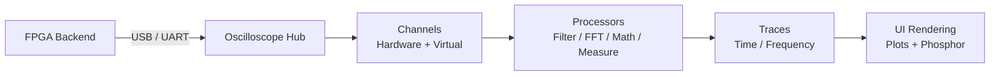

# Scoped Architecture

Scoped is a C++ software oscilloscope backed by an FPGA frontend. The software is built around a modular, two-pass data pipeline. This document mirrors the summary in the [README](../README.md) `Architecture` section, then expands on each layer, the core objects, and the codebase file map.

## Overview

At a high level, data flows through five stages: the hardware captures samples, the hub drives synchronized frames, channels own the acquisition and processing, processors generate traces, and the UI renders them.



The pipeline is split into four layers:

- **Oscilloscope:** Manages hardware interfaces (USB/UART), coordinates global triggers, and drives the multi-channel synchronization engine.
- **Channels:** `Channel<HardwareT>` handles lock-free buffer acquisition, while `VirtualChannel` processes cross-channel logic. Both yield standard `Trace` objects.
- **Processors:** Expandable modules (FFT, Filters, Math, Measurements) that take raw frames and mutate or generate new trace representations.
- **UI:** Iterates over generated traces and maps them to the appropriate rendering subsystems (digital phosphor map or standard plots) based on their domain metadata.

## Data Pipeline

The detailed data flow shows where each stage lives and how the layers connect:

```mermaid
flowchart TD
    HW[FPGA Backend]

    subgraph Interface ["Hardware Interface"]
        USB[USBDevice<br/>CDC bulk transfer, bg thread]
        UART[UARTDevice<br/>low-rate serial]
    end

    HW --> USB & UART

    subgraph Core ["Oscilloscope (Hub)"]
        OSC[Oscilloscope<br/>Two-Pass Update Engine]
        TRG[ITrigger / EdgeTrigger]
        CB[CircularBuffer]
        OSC --> TRG
        OSC --> CB
    end

    USB & UART --> OSC

    subgraph Channels ["IChannel / Channel"]
        HC[Channel&lt;HardwareT&gt;<br/>owns buffer + IProcessor chain]
        VC[VirtualChannel<br/>owns IVirtualProcessor chain]
    end

    OSC --> HC
    CB -. samples .-> HC
    VC -. reads raw frames .-> HC

    subgraph Proc ["Processors"]
        IP["IProcessor<br/>(FFT)"]
        VP[IVirtualProcessor<br/>(Math, Filter, Measurement)]
    end

    HC --> IP
    VC --> VP

    subgraph Traces ["Trace Objects"]
        TR[Trace<br/>Domain: Time / Frequency]
    end

    IP --> TR
    VP --> TR
    HC --> TR

    subgraph Render ["UI Rendering"]
        IM[IntensityMap<br/>phosphor rasterizer]
        PLT[Plot subsystems<br/>routed by Domain]
    end

    TR --> PLT
    TR --> IM
    PLT --> IM
```

The stages in detail:

- **Oscilloscope (Hub)** coordinates hardware, global triggers, and implements a **Two-Pass Update Engine** (updating hardware channels first, then virtual channels).
- **IChannel / Channel** abstracts data sources. `Channel<HardwareT>` owns a `CircularBuffer` and a chain of `IProcessor`s. `VirtualChannel` evaluates cross-channel logic via `IVirtualProcessor`s. Both output `Trace` objects.
- **Processors** act as generators. `IProcessor`s take a single channel's raw frame and create or mutate traces (e.g., an FFT Trace); `IVirtualProcessor`s combine multiple channel traces (e.g., math or filtered traces).
- **UI** iterates over generated traces and routes them to the correct plotting subsystem based on their `Domain` metadata.

## Objects

### Oscilloscope

The central core abstraction. Owns the hardware connections (`USBDevice` / `UARTDevice`), the global trigger engine (`ITrigger`), and an array of abstract `IChannel` objects. Provides multi-channel synchronization by evaluating a trigger on a source channel and capturing a time-aligned frame across all channels simultaneously using a Two-Pass execution model.

### CircularBuffer\<T\>

Lock-free ring buffer for raw sample acquisition.

### ITrigger

Abstract base for type-agnostic trigger strategies. Operates on normalized float samples from an `IChannel` to avoid coupling with specific hardware bit-depths.

- Exposes `getUIParameters()` and `getTriggerLevels()` so the UI can dynamically generate controls (sliders, combos) and draw trigger lines.
- **EdgeTrigger** — Fires when a sample crosses a threshold with hysteresis. Supports rising/falling edge selection.

### IProcessor & IVirtualProcessor

Both processor base classes derive from `IProcessorControl`, which exposes the uniform UI controls (enable state, scale/offset, color) shared by all processing modules.

- **IProcessor** applies isolated signal processing on a single channel's raw frame. Its only implementation is `FFTProcessor`.
- **IVirtualProcessor** takes data from multiple channel traces and produces new traces. Implementations include `MathProcessor` (cross-channel math), `FilterProcessor`, and `MeasurementProcessor`.

### Trace

A single output artifact representing a plottable line or matrix. Contains metadata such as `Domain::Time` or `Domain::Frequency` along with localized scaling parameters. Extensible for Decoders and Measurements.

### IChannel, Channel\<HardwareT\> & VirtualChannel

- **IChannel**: Type-agnostic interface exposing normalized samples and output traces.
- **Channel\<HardwareT\>**: A concrete hardware pipeline owning a `CircularBuffer` and a chain of `IProcessor`s.
- **VirtualChannel**: A channel without a buffer that reads raw frames from source `IChannel`s and applies `IVirtualProcessor`s.

### IntensityMap

2D hit-count grid for digital phosphor display. Accepts time-domain normalized data and rasterizes using Bresenham lines.

### Hardware Interface

Provides data acquisition from the FPGA backend.

- **USBDevice**: CDC bulk-transfer interface running a background thread for high-speed streaming.
- **UARTDevice**: Slower serial interface for stable data capture at lower sampling rates.

## File Map

The codebase is organized into four main modules within the `core` directory:

### `common/`

Core data structures and base interfaces.

| File | Role |
|---|---|
| `oscilloscope.hpp` | Central hub & Two-Pass updater |
| `channel.hpp` | IChannel, Channel\<T\>, VirtualChannel |
| `trace.hpp` | Trace object + Domain metadata |
| `circularbuffer.hpp` | Ring buffer (header-only template) |
| `constants.hpp` | Global configuration constants |

### `hardware/`

Physical communication layers.

| File | Role |
|---|---|
| `usb.hpp/.cpp` | High-speed USB CDC acquisition |
| `uart.hpp/.cpp` | Serial UART acquisition |

### `processing/`

Signal processing nodes.

| File | Role |
|---|---|
| `iprocessor.hpp` | Base classes IProcessorControl, IProcessor, IVirtualProcessor |
| `trigger.hpp` | ITrigger + EdgeTrigger |
| `filter_processor.hpp` | Cascaded dual-biquad IIR filter |
| `fft_processor.hpp` | Real-time Fast Fourier Transform |
| `math_processor.hpp` | Cross-channel math operations |
| `measurement_processor.hpp` | Waveform statistics (Vpp, Vrms, Freq) |
| `window.hpp` | Window functions for FFT |

### `ui/`

User Interface and rendering.

| File | Role |
|---|---|
| `ui.hpp/.cpp` | Main UI layout, rendering loops |
| `ui_*.cpp` | Submodules for Channels, FFT, Math, Filters |
| `intensitymap.hpp/.cpp` | Phosphor display rasterizer |
| `ui_helpers.hpp` | ImGui helper utilities |
| `colors.hpp` | Centralized color themes |

### Root

| File | Role |
|---|---|
| `main.cpp` | SDL lifecycle + main loop initialization |
